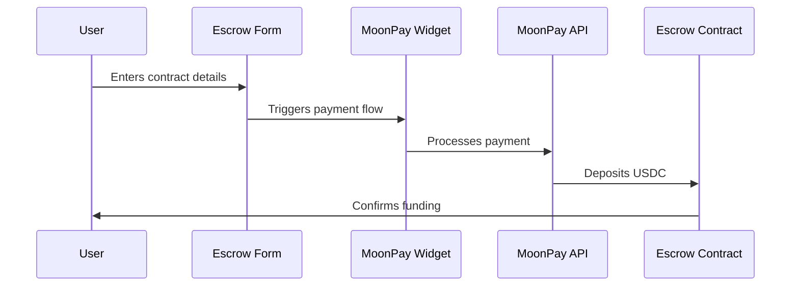

## 📝Integrating Moonpay into Trustless Work Escrow Flow
**🚀 Architecture Overview**

A Proof of Concept (PoC) integrating Moonpay into the Trustless Work escrow flow enabling users to deploy escrow contracts via the Trustless Work API, leveraging the existing Trustless Work escrow dApp for rapid development. The integration connects MoonPay's fiat on-ramp with Trustless Work's escrow system using a client-side architecture. The flow consists of three main components:

| Component | Purpose | Implementation |
|-----------|---------|----------------|
| Escrow Contract | Holds funds in USDC on Stellar | Smart contract on Stellar network |
| MoonPay Widget | Handles fiat payment processing | Client-side React component |
| Integration Layer | Connects payment to escrow | Custom React hooks and services |

## Integration Flow



## Implementation Guide

## 1. Project Setup

### Initial Configuration
Please ensure that the first item starts with `pk`, as it represents the publishing key, and the second item is `sk`.
```typescript
// .env.local
NEXT_PUBLIC_MOONPAY_API_KEY=your_api_key_here
MOONPAY_SECRET_KEY=your_secret_key_here
```

### Dependencies Installation
Installing MoonPay SDK and Shadcn UI Components
```bash
npm install @moonpay/moonpay-react @radix-ui/react-dialog
```
**Other Important Moonpay site configurations.**
1. Please ensure that the following three items are activated.

2. Additionally, ensure that your deployed site is linked under the domains.


## 2. Component Structure

### MoonPay Client Provider
Application is wrapped with MoonPay's Context Provider before proceeding
```typescript
// src/components/providers/MoonPayClientProvider.tsx
"use client";
import { MoonPayProvider } from "@moonpay/moonpay-react";

export function MoonPayClientProvider({ children }: { children: React.ReactNode }) {
  return (
    <MoonPayProvider 
      apiKey={process.env.NEXT_PUBLIC_MOONPAY_API_KEY}
      debug={process.env.NODE_ENV === 'development'}
    >
      {children}
    </MoonPayProvider>
  );
}
```

### Custom Hook Implementation
```typescript
// src/hooks/useMoonPay.ts
export const useMoonPay = () => {
  const [isWidgetOpen, setIsWidgetOpen] = useState(false);
  
  const handleMoonPaySuccess = useCallback(async (transactionId: string, contractId: string) => {
    try {
      const verification = await verifyMoonPayTransaction(transactionId);
      // Implementation details...
    } catch (error) {
      console.error("MoonPay transaction failed:", error);
    }
  }, []);

  return { isWidgetOpen, setIsWidgetOpen, handleMoonPaySuccess };
};
```

## 3. Form Implementation

### Radio Group for Payment Method
```typescript
<FormField
  control={form.control}
  name="paymentMethod"
  render={({ field }) => (
    <FormItem>
      <FormLabel>Payment Method</FormLabel>
      <FormControl>
        <RadioGroup
          onValueChange={field.onChange}
          value={field.value}
          defaultValue="wallet"
        >
          <FormItem className="flex items-center space-x-3 space-y-0">
            <FormControl>
              <RadioGroupItem value="wallet" />
            </FormControl>
            <FormLabel className="font-normal">Pay with Wallet</FormLabel>
          </FormItem>
          <FormItem className="flex items-center space-x-3 space-y-0">
            <FormControl>
              <RadioGroupItem value="card" />
            </FormControl>
            <FormLabel className="font-normal">
              Pay with Card (via MoonPay)
            </FormLabel>
          </FormItem>
        </RadioGroup>
      </FormControl>
    </FormItem>
  )}
/>
```

## 4. MoonPay Service Implementation

### URL Generation
use eth for initialisation with Moonpay services first, then opt your required currency.
```typescript
// src/services/moonpay/moonpayService.ts
const  MOONPAY_CONFIG:  MoonPayConfig  = {
	apiKey:  process.env.NEXT_PUBLIC_MOONPAY_API_KEY  ||  "",
	baseUrl:  "https://buy-staging.moonpay.com",
	currency:  "usdc_xlm",
};
export const generateMoonPayUrl = async (contractId: string, amount: number) => {
  const { address } = await kit.getAddress();
  
  const params = new URLSearchParams({
    apiKey: MOONPAY_CONFIG.apiKey,
    currencyCode: MOONPAY_CONFIG.currency,
    walletAddress: address,
    baseCurrencyAmount: amount.toString(),
    redirectURL: `${window.location.origin}/dashboard/escrow/fund-escrow/success?contractId=${contractId}`,
    failureRedirectURL: `${window.location.origin}/dashboard/escrow/fund-escrow/failure`,
  });

  return `${MOONPAY_CONFIG.baseUrl}?${params.toString()}`;
};
```

### Transaction Verification
```typescript
// src/app/api/moonpay-callback/route.ts
export async function GET(request: NextRequest) {
  const searchParams = request.nextUrl.searchParams;
  const transactionId = searchParams.get("transactionId");

  try {
    const response = await fetch(
      `https://api.moonpay.com/v1/transactions/${transactionId}`,
      {
        headers: {
          Authorization: `Api-Key ${process.env.MOONPAY_SECRET_KEY}`,
        },
      }
    );
    return NextResponse.json(await response.json());
  } catch (error) {
    return NextResponse.json(
      { error: "Failed to verify transaction" },
      { status: 500 }
    );
  }
}
```

## 5. Widget Integration

### MoonPay Widget Component
since we are testing the PoC, we use Sandbox environment inside Moonpay to get test values.
```typescript
// src/components/modules/moonpay/MoonPayWidget.tsx
export function MoonPayWidget({
  isOpen,
  onClose,
  contractId,
  amount,
}: MoonPayWidgetProps) {
  useEffect(() => {
    if (isOpen) 
      const script = document.createElement("script");
      script.src = "https://static.moonpay.com/web-sdk/v1/moonpay-web-sdk.min.js";
      script.async = true;

      script.onload = () => {
        const moonpaySdk = window.MoonPayWebSdk.init({
          environment: "sandbox",
          variant: "overlay",
          params: {
            apiKey: process.env.NEXT_PUBLIC_MOONPAY_API_KEY,
            baseCurrencyAmount: amount.toString(),
            walletAddress: contractId,
          },
          onClose,
        });
        moonpaySdk.show();
      };
      
      document.body.appendChild(script);
      return () => {
        document.body.removeChild(script);
      };
    }
  }, [isOpen, contractId, amount]);

  return null;
}
```

## 6. Error Handling

```typescript
const handleError = (error: any) => {
  toast({
    title: "Error",
    description: error.message || "An error occurred during payment processing",
    variant: "destructive",
  });
};
```

## Core Components

### FundEscrowForm
- Handles user input for contract details
- Manages payment method selection
- Triggers MoonPay widget when card payment is selected

### MoonPayWidget
- Renders the MoonPay payment interface
- Handles payment callbacks
- Manages widget lifecycle

### MoonPay Service
- Generates payment URLs
- Verifies transactions
- Handles callbacks from MoonPay

## Testing Instructions

1. **Setup Test Environment**
   - Use sandbox API keys
   - Test with provided test card
   
| Test Card Number | Expiration | CVC |
|--|--|--|
| 4485 0403 7153 6584 | 12/2030 |123 |
 - Input an Ethereum wallet address, or feel free to use their provided address:`0xc216eD2D6c295579718dbd4a797845CdA70B3C36`

2. **Test Flow**
   - Initialize escrow contract with required details.
     
   - Select "Pay with Card (via MoonPay)"
     
   - Login and test with the above card details.
   - Verify funds in escrow contract

## Error Handling

The integration includes comprehensive error handling:
- Transaction verification failures
- Payment processing errors
- Contract funding failures

## Security Considerations

- API keys are stored in environment variables
- Transaction verification occurs server-side
- Wallet addresses are validated before processing

## Additional Resources

- MoonPay API Documentation
- Stellar USDC Documentation
- Trustless Work API Documentation

## Troubleshooting

Common issues and solutions:
- **HTMH22FI or similar character Error**: Verify domain whitelisting as mentioned previously.
  
- **Widget Loading Issues**: Check API key configuration
- **Transaction Failures**: Verify test card details
 [Refer to this FAQ](https://dev.moonpay.com/docs/off-ramp-faq)

## Production Deployment

1. Replace sandbox API keys with production keys
2. Update webhook endpoints
3. Configure production URLs
4. Enable transaction monitoring

The integration provides a seamless experience for users to fund escrow contracts using fiat currency, with automatic conversion to USDC on the Stellar network.